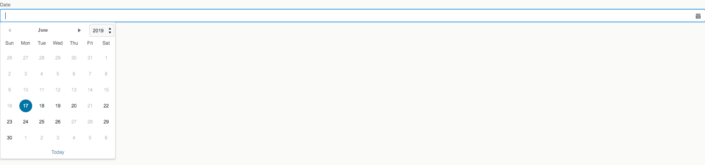

# SF-Lightning-Custom-Input-Date-Field
Custom Lightning input date field by jQuery + UI Date Picker 

1) Upload jquery-ui-1.12.1.zip and jquery.min.js to static resource with names 'JqueryUI' and 'jQuery' respectively
2) Add DatePickerWithRestrictedDates to your Lightning component. 
3) To set your disabled dates - change disabledDates constant in controller.
